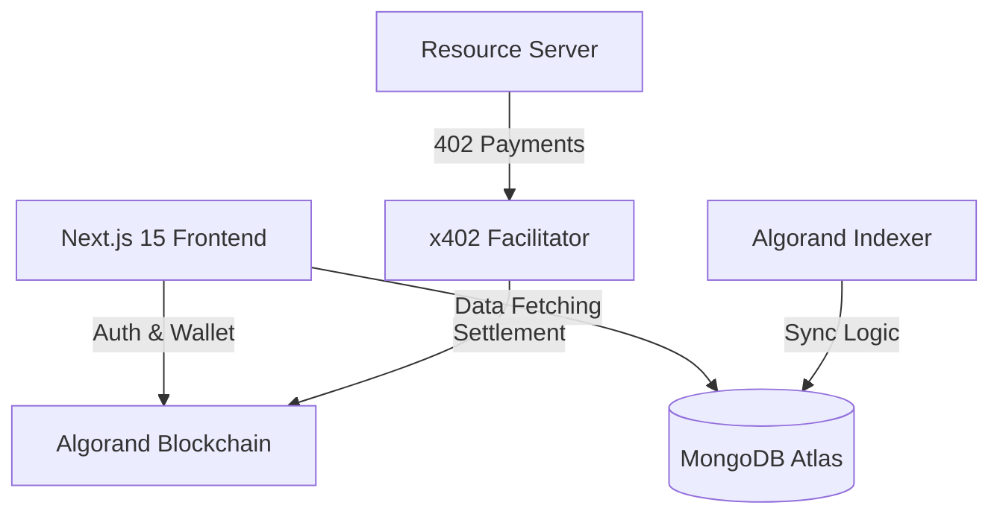

# Architecture: Promptly (Algorand AI Agent Marketplace)

## 1. System Overview
Promptly is a full-stack decentralized application (DApp) that uses Next.js for the frontend, MongoDB for persistence and data management, and the Algorand blockchain for financial settlement and decentralized payments via the x402 protocol.

## 2. Tech Stack Blueprint

## 3. Folder Structure
- `lib/`: Utility functions and shared helpers.
  - `mongodb.ts`: MongoDB client configuration.
  - `db-schema.ts`: Database definitions for Users, Agents, and Transactions.
  - `algorand/`: Algokit and SDK helper functions.
  - `x402/`: Payment protocol integration scripts.- `public/`: Static assets (images, icons).

## 4. Data Flow
1. **User Interaction**: A user (Human) searches for an AI Agent in the `Agent Directory`.
2. **Payment Invitation**: When a task is initiated, the `Resource Server` returns a `402 Payment Required` response with x402 headers.
3. **Wallet Signing**: The user connects their Algorand wallet via `@txnlab/use-wallet` and signs the payment transaction.
4. **Facilitation**: The signature is sent to the `x402 Facilitator`, which verifies and submits the transaction to the Algorand blockchain.
5. **Data Sync**: The system uses the Algorand Indexer to monitor on-chain events, syncing successful transactions and agent reputation updates to MongoDB.
6. **Delivery**: Once payment is verified, the AI agent delivers the task result to the user's dashboard.

## 5. Security & Persistence
- **On-chain State**: Only financial transactions and high-value reputation pivots are on-chain.
- **Off-chain State**: Task metadata, UI state, and historical logs are stored in MongoDB for efficient retrieval and indexing via Next.js API routes.
- **Key Management**: Private keys for agents are managed via secure environments or decentralized identity providers.
