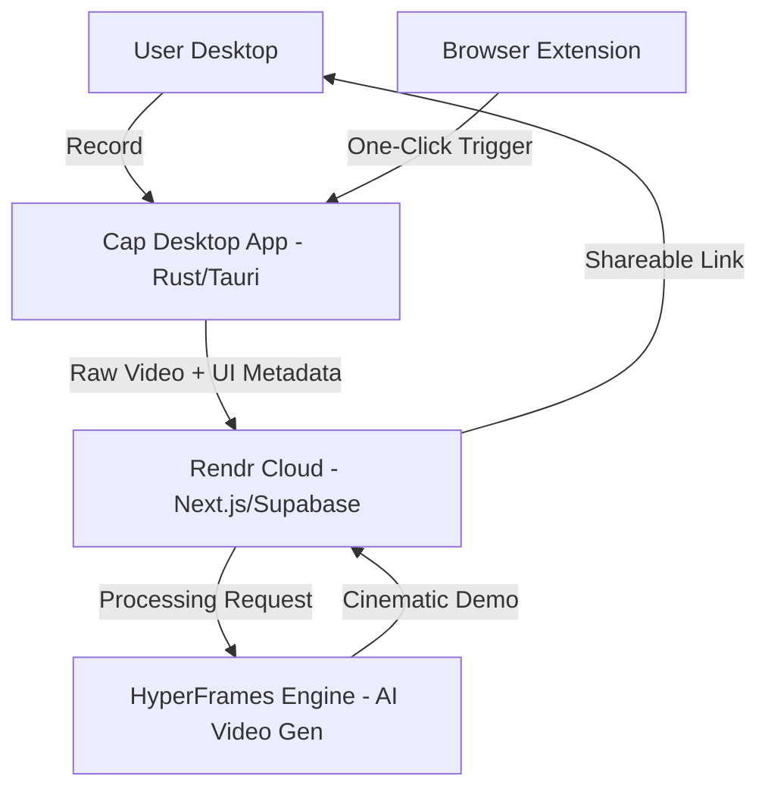

# Architecture: Rendr (AI Product Demo Maker)

## 1. System Overview
Rendr is a high-performance video generation platform that combines desktop screen capture with AI-powered cinematic rendering. It utilizes **Cap** as the recording foundation and **HyperFrames** as the AI engine for video enhancement.

## 2. Tech Stack Blueprint

## 3. Folder Structure
- `Cap/`: The recording engine.
  - `crates/`: Rust crates for screen capture, audio, and video encoding.
  - `apps/desktop/`: Tauri-based desktop application.
- `rendr-landing-page/`: The web dashboard and marketing site.
  - `app/`: Next.js App Router for the dashboard and sharing pages.
  - `lib/`: Integration layers for HyperFrames and Supabase.
- `_references/`: Demo assets and HyperFrames reference implementations.

## 4. Data Flow
1. **Capture**: The user starts a recording via the Cap desktop app or the Rendr browser extension.
2. **Metadata Extraction**: While recording, Cap extracts DOM metadata (if on web) or UI accessibility trees (if on desktop).
3. **Upload**: Raw video and metadata are streamed to Rendr Cloud (Supabase storage).
4. **AI Generation**: The HyperFrames engine analyzes the metadata to identify "key moments" (clicks, scrolls, typing) and generates camera paths (zooms, pans).
5. **Rendering**: The final video is rendered with premium aesthetics, including background blurs, cursor smoothing, and high-fidelity overlays.
6. **Delivery**: The user receives a shareable link to the polished demo.

## 5. Security & Privacy
- **Local First**: Recordings are captured and can be edited locally before ever being uploaded.
- **Data Ownership**: Users have full control over their recording data, with options for self-hosting via the Cap foundation.
- **Secure Processing**: AI processing is done in isolated environments to ensure UI metadata privacy.
